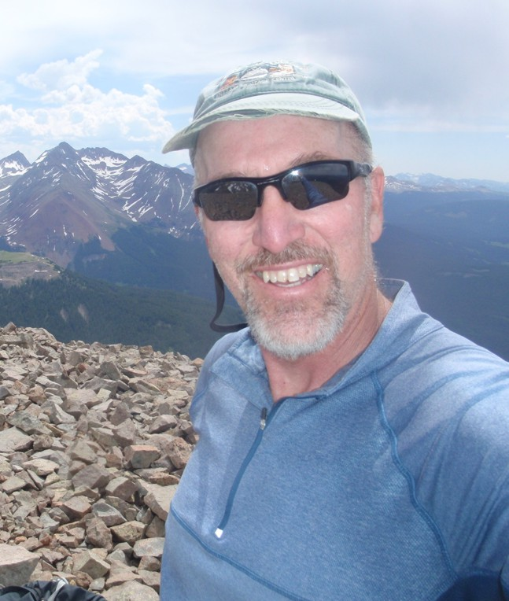
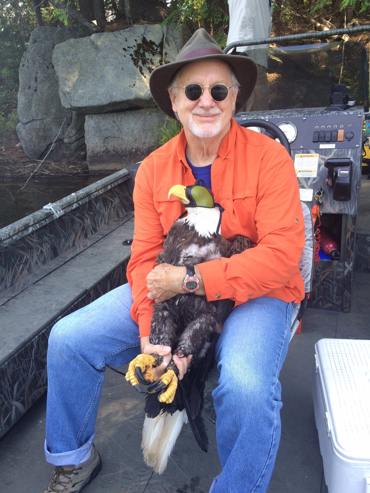
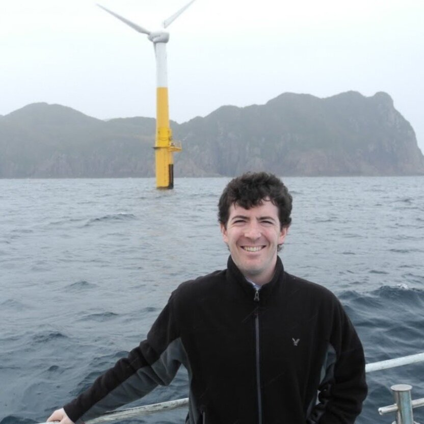
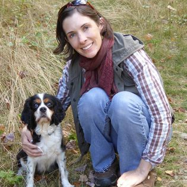

---
class: center, top
name: Title Slide


## Habitat Use and and Individual-Based Modeling <br> of Bald Eagles in Maine <br> Near Current and Potential Wind Energy Facilities  

### Blake Massey  

```{r, results='asis', include = TRUE}
current_date <- paste0("### ", format(Sys.time(), '%Y-%m-%d'))
cat(current_date)
```
   
---
class: split-20 

.row.bg-main1[.content.center[
## Acknowledgments - Advisors
]]
.row[.content.center[
.split-four[
.column[.content.fig90[
    #### Kevin McGarigal
    
]]
.column[.content.fig90[
    #### Curt Griffin  
      
]]
.column[.content.fig90[
    #### Matt Lackner
            
]]
.column[.content.fig90[
    #### Erynn Call
                 
]]
]]]
.white[NOTE: For some reason there needs to be text after the last bracket.]

---
class: split-20 

.row.bg-main1[.content.center[
## Acknowledgments - Lab Mates
]]
.row[.content.center[
.split-three[
.column[.content.fig90[
    #### Javan Bauder
    
]]
.column[.content.fig90[
    #### Kathy Zeller  
      
]]
.column[.content.fig90[
    #### Kristopher Winiarski
            
]]
]]]
.white[NOTE: For some reason there needs to be text after the last bracket.]

---
class: split-20 

.row.bg-main1[.content.center[
## Acknowledgments - Field Crew
]]
.row[.content.center[
.split-five[
.column[.content.fig90[
    #### Chris Desorbo
    
]]
.column[.content.fig90[
    #### Lauren Gilpatrick  
      
]]
.column[.content.fig90[
    #### Chris Persico
            
]]
.column[.content.fig90[
    #### Bill Hanson
                 
]]
.column[.content.fig90[
    #### Rick Gray
                 
]]
]]]
.white[NOTE: For some reason there needs to be text after the last bracket.]


