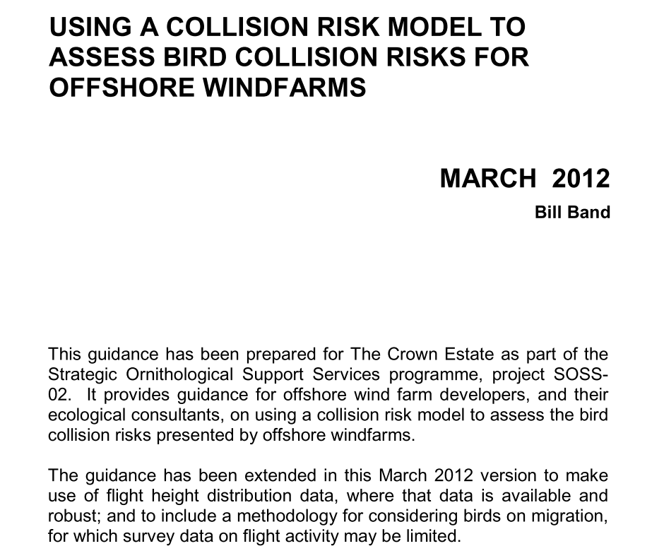
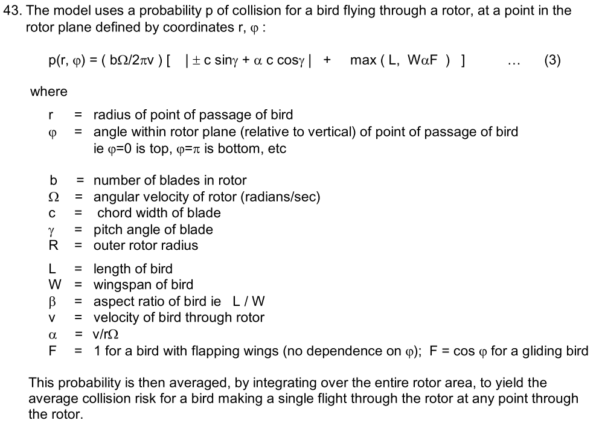
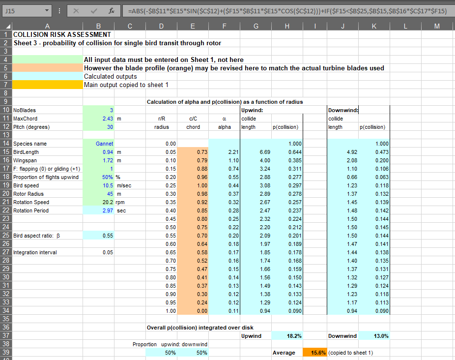
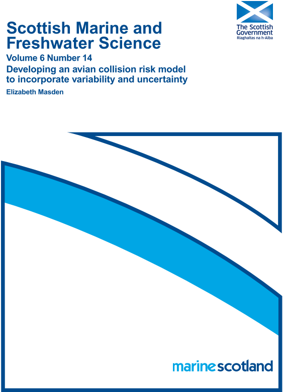
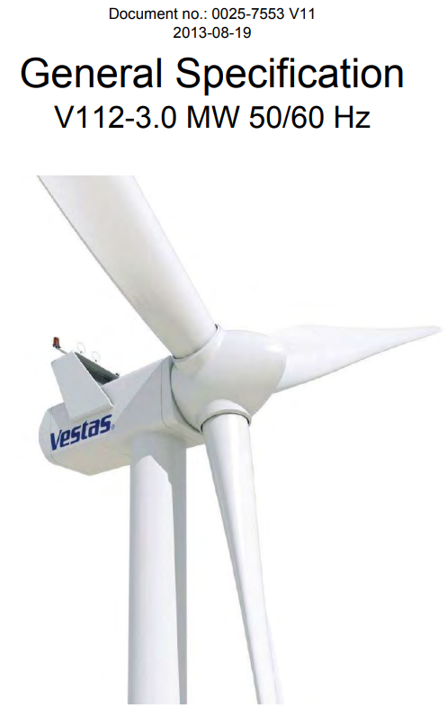

---
class: center, top

background-image: url("Assets/Images/windfarmGA.png")
background-position: 40% 5%
background-size: 85px

### &nbsp;&nbsp;&nbsp;&nbsp;&nbsp;&nbsp;&nbsp;&nbsp;&nbsp;&nbsp;&nbsp;&nbsp;&nbsp;&nbsp;windfarmGA

.pull-left[.center[
#### Greenville Airport Windrose  

]]

.pull-right[.center[
#### Wind Farm Areas
  
<u>Parameters</u>  
Hub Height = 80m  
Rotor Radius = 56m
]]

---
class: split-main2

.row.bg-main1[.content.center[
### Wind Farm Scenarios Turbine Locations
]]
.row[.content.center[
.split-four[
.column[.content[<br>
#### Control
 
]]
.column[.content[<br>
#### North and South
 
]]
.column[.content[<br>
#### North

]]
.column[.content[<br>
#### South

]]
]]]
.white[NOTE: For some reason there needs to be text after the last bracket.]

---
class: split-main2

.row.bg-main1[.content.center[
### Cruise Path Density
]]
.row[.content.center[
.split-four[
.column[.content[<br>
#### Control
 
]]
.column[.content[<br>
#### North and South
 
]]
.column[.content[<br>
#### North
  
]]
.column[.content[<br>
#### South
 
]]
]]]
.white[NOTE: For some reason there needs to be text after the last bracket.]

---
class: split-main2

.row.bg-main1[.content.center[
### Flight Path Density
]]
.row[.content.center[
.split-four[
.column[.content[<br>
#### Control
 
]]
.column[.content[<br>
#### North and South
 
]]
.column[.content[<br>
#### North

]]
.column[.content[<br>
#### South

]]
]]]
.white[NOTE: For some reason there needs to be text after the last bracket.]

---
```{r echo=F, message=FALSE, warning=FALSE, eval = TRUE, include = TRUE}
pacman::p_load(dplyr, mapview, sf, viridis)

mapviewOptions(basemaps = c("Esri.NatGeoWorldMap", "Esri.WorldImagery"),
  raster.palette = plasma,
  vector.palette = colorRampPalette(c("snow", "cornflowerblue", "grey10")),
  na.color = NA, homebutton = FALSE,
  layers.control.pos = "topleft", leafletWidth = "100%", 
  leafletHeight = "325px")

# Variables
mapping <- FALSE
nest_color <- "red"
wind_area_color <- "darkorange"
turbine_color <- "purple"
turbine_color_present <- "white"
turbine_color_absent <- "black"

# Directories
exp_output_dir <- file.path("C:/Users/blake/OneDrive/Work/R/Projects/baea_ibm",
  "Output/Experiment")
exp_turbines_dir <- "C:/ArcGIS/Data/R_Input/EXP"
line_density_dir <- "Line_Density_Rasters"
line_density_agg_dir <- "Agg_10"
nests_dir <- file.path("C:/Users/blake/OneDrive/Work/R/Projects/baea_ibm",
  "Data/Nests/Nests_rds")

# Nests
nests_study_org <- readRDS(file.path(nests_dir, "nests_study.rds"))
nests_study <- st_as_sf(x = nests_study_org, coords = c("long", "lat"),
  crs = "+proj=longlat +datum=WGS84") %>% filter(!name %in% c("Davis", "Upper"))

# Layers
wilson_wt_n = st_read(file.path(exp_turbines_dir, "wilson_n_turbines.shp"),
  quiet = TRUE)
wilson_wt_s = st_read(file.path(exp_turbines_dir, "wilson_s_turbines.shp"),
  quiet = TRUE)
wilson_wt_n_buff <- wilson_wt_n %>% st_buffer(56)
wilson_wt_s_buff <- wilson_wt_s %>% st_buffer(56)

j <- "Flight"
exp_lines_raster_c <- readRDS(file.path(exp_output_dir, line_density_dir,
  line_density_agg_dir, paste0("Exp_Lines_", j, "_C.rds")))
exp_lines_raster_n <- readRDS(file.path(exp_output_dir, line_density_dir,
  line_density_agg_dir, paste0("Exp_Lines_", j, "_N.rds"))) 
exp_lines_raster_ns <- readRDS(file.path(exp_output_dir, line_density_dir,
  line_density_agg_dir, paste0("Exp_Lines_", j, "_NS.rds")))
exp_lines_raster_s <- readRDS(file.path(exp_output_dir, line_density_dir,
  line_density_agg_dir, paste0("Exp_Lines_", j, "_S.rds")))

# Get nest
nest_wilson <- nests_study %>% slice(c(5)) %>% st_transform(st_crs(wilson_wt_n))

nest_mapview <- mapview(nest_wilson, shape = 20, legend = FALSE,
  color = "black", col.region = "red", size = .075) 

# Create turbines mapviews
turbines_n_present <- mapview(wilson_wt_n_buff, legend = FALSE, 
  color = turbine_color_present, col.regions = turbine_color_present, lwd = 1)
turbines_n_absent <- mapview(wilson_wt_n_buff, legend = FALSE,
  color = turbine_color_absent, col.regions = turbine_color_absent, lwd = 1)
turbines_s_present <- mapview(wilson_wt_s_buff, legend = FALSE,
  color = turbine_color_present, col.regions = turbine_color_present, lwd = 1)
turbines_s_absent <- mapview(wilson_wt_s_buff, legend = FALSE,
  color = turbine_color_absent, col.regions = turbine_color_absent, lwd = 1)

# Set legend breaks for raster
map_breaks <- c(1, 10, 100, 1000, 10000) #, 100000)

# Create scenario mapviews
map_c <- mapview(exp_lines_raster_c, at = map_breaks, alpha = .6, 
  query.type = 'click', layer.name = paste0("Control - ", j, " Path Density")) +
  turbines_n_absent + turbines_s_absent + nest_mapview
map_ns <- mapview(exp_lines_raster_n, at = map_breaks, alpha = .6, 
  query.type = 'click', layer.name = paste0("North and South - ", j, 
    " Path Density")) +
  turbines_n_present + turbines_s_present + nest_mapview
map_n <- mapview(exp_lines_raster_n, at = map_breaks, alpha = .6, 
  query.type = 'click', layer.name = paste0("North - ", j, " Path Density")) +
  turbines_n_present + turbines_s_absent + nest_mapview 
map_s <- mapview(exp_lines_raster_s, at = map_breaks, alpha = .6,
  query.type = 'click', layer.name = paste0("South - ", j, " Path Density")) +
  turbines_n_absent + turbines_s_present + nest_mapview

# Hide attribution
map_c@map[["x"]][["options"]][["attributionControl"]] <- FALSE
map_ns@map[["x"]][["options"]][["attributionControl"]] <- FALSE
map_n@map[["x"]][["options"]][["attributionControl"]] <- FALSE
map_s@map[["x"]][["options"]][["attributionControl"]] <- FALSE

# Hide NA in legend
map_c@map[["x"]][["calls"]][[7]][["args"]][[1]][["na_color"]] <- ""
map_c@map[["x"]][["calls"]][[7]][["args"]][[1]][["na_label"]] <- ""
map_ns@map[["x"]][["calls"]][[7]][["args"]][[1]][["na_color"]] <- ""
map_ns@map[["x"]][["calls"]][[7]][["args"]][[1]][["na_label"]] <- ""
map_n@map[["x"]][["calls"]][[7]][["args"]][[1]][["na_color"]] <- ""
map_n@map[["x"]][["calls"]][[7]][["args"]][[1]][["na_label"]] <- ""
map_s@map[["x"]][["calls"]][[7]][["args"]][[1]][["na_color"]] <- ""
map_s@map[["x"]][["calls"]][[7]][["args"]][[1]][["na_label"]] <- ""

leafsync::sync(map_c, map_ns, map_n, map_s, sync.cursor = FALSE)
```

---
class: split-main2

.row.bg-main1[.content.center[
### Cruise and Flight Transit - Wind Areas
]]
.row[.content.center[
.split-two[
.column[.content[<br>
#### North Area Wind Transits
 
]]
.column[.content[<br>
#### South Wind Area Transits
 
]]
]]]
.white[NOTE: For some reason there needs to be text after the last bracket.]

---
class: split-main2

.row.bg-main1[.content.center[
### Cruise and Flight Transits - Wind Turbines
]]
.row[.content.center[
.split-two[
.column[.content[<br>
#### North Turbine Transits
 
]]
.column[.content[<br>
#### South Turbine Transits

]]
]]]
.white[NOTE: For some reason there needs to be text after the last bracket.]

---
class: split-main2

.row.bg-main1[.content.center[
### Flight Path Transits - Wind Turbines
]]
.row[.content.center[
.split-two[
.column[.content[<br>
#### North Turbine Transits
 
]]
.column[.content[<br>
#### South Turbine Transits

]]
]]]
.white[NOTE: For some reason there needs to be text after the last bracket.]

---
class: split-main2

.row.bg-main1[.content.center[
### Flight Path Transits - Wind Turbines
]]
.row[.content.center[
.split-two[
.column[.content[<br>
#### North Turbine Transits
 
]]
.column[.content[<br>
#### South Turbine Transits

]]
]]]
.white[NOTE: For some reason there needs to be text after the last bracket.]

---
class: center, middle


### "No of collisions = number of transits x probability of collision"

---
class: center, middle

### Single Transit Collision Risk


---
class: center, middle

### Band 2012 - Excel Workbook


---
class: center, top


---
class: center, top

### Masden 2015 - R Code
```{r Masden2015Code, eval = FALSE,  echo = TRUE, include = TRUE}
CollisionRiskTab = data.frame(matrix(data = 0, nrow = 21, ncol = 7))
names(CollisionRiskTab) = c("radius",
  "chord",
  "alpha",
  "Up_length",
  "Up_P",
  "Down_length",
  "Down_P")
CollisionRiskTab$radius = seq(0, 1, 0.05)

CollisionRiskTab$chord = c(
  NA,
  0.73,
  0.79,
  0.88,
  0.96,
  1.00,
  0.98,
  0.92,
  0.85,
  0.80,
  0.75,
  0.70,
  0.64,
  0.58,
  0.52,
  0.47,
  0.41,
  0.37,
  0.30,
  0.24,
  0.00
) #### can be revised to match actual turbine blades

CollisionRiskTab$alpha[1] = NA
CollisionRiskTab$Up_length[1] = NA
CollisionRiskTab$Up_P[1] = 1
CollisionRiskTab$Down_length[1] = NA
CollisionRiskTab$Down_P[1] = 1

### populate collision risk table

for (u in 1:20) {
  #### First calculate alphas

  CollisionRiskTab$alpha[u + 1] = sampledbirdSpeed[i] * (60 / sampledRotorSpeed[i]) /
    (CollisionRiskTab$radius[u + 1] * sampledRotorRadius[i] * 2 * pi)

  #### Now calculate upwind length

  ifelse (
    CollisionRiskTab$alpha[u + 1] < (sampledbirdLength[i] / sampledWingSpan[i]),
      sampledbirdLength[i] +
        abs(sampledBladeWidth[i] * CollisionRiskTab$chord[u + 1] * sin(Pitch[1]) +
          (CollisionRiskTab$alpha[u + 1] * sampledBladeWidth[i] *
              CollisionRiskTab$chord[u + 1] * cos(Pitch[1])
            )
        ) -> CollisionRiskTab$Up_length[u + 1],

    (sampledWingSpan[i] * Flap_Glide * CollisionRiskTab$alpha[u + 1]) +
      abs(
        sampledBladeWidth[i] * CollisionRiskTab$chord[u + 1] * sin(Pitch[1]) +
          (CollisionRiskTab$alpha[u + 1] * sampledBladeWidth[i] * 
            CollisionRiskTab$chord[u + 1] * cos(Pitch[1]))
      ) -> CollisionRiskTab$Up_length[u + 1]
  )

  #### Now calculate upwind probability of collision

  CollisionRiskTab$Up_P[u + 1] = min (1,
    (TurbineData$Blades[t] / (60 / sampledRotorSpeed[i])) * 
      CollisionRiskTab$Up_length[u + 1] / sampledbirdSpeed[i])

  #### Now calculate downwind length

  ifelse (
    CollisionRiskTab$alpha[u + 1] < (sampledbirdLength[i] / sampledWingSpan[i]),

      sampledbirdLength[i] +
        abs(
          -sampledBladeWidth[i] * CollisionRiskTab$chord[u + 1] * sin(Pitch[1]) +
            (CollisionRiskTab$alpha[u + 1] * sampledBladeWidth[i] * 
                CollisionRiskTab$chord[u + 1] * cos(Pitch[1]))
        ) -> CollisionRiskTab$Down_length[i + 1],

      (sampledWingSpan[i] * Flap_Glide * CollisionRiskTab$alpha[u + 1]) +
        abs(-sampledBladeWidth[i] * CollisionRiskTab$chord[i + 1] * sin(Pitch[1]) +
          (CollisionRiskTab$alpha[u + 1] * sampledBladeWidth[i] * 
            CollisionRiskTab$chord[i + 1] * cos(Pitch[1]))
        ) -> CollisionRiskTab$Down_length[u + 1]
  )

#### Now calculate Down wind probability of collision

CollisionRiskTab$Down_P[u + 1] = min (1, (TurbineData$Blades[t] /
  (60 / sampledRotorSpeed[i])) * CollisionRiskTab$Down_length[u + 1] / 
    sampledbirdSpeed[i])
}

Total_Up_Wind_P = 2 * (sum(CollisionRiskTab$radius[2:20] * 
  CollisionRiskTab$Up_P[2:20]) + CollisionRiskTab$Up_P[21] / 2) * 0.05

Total_Down_Wind_P = 2 * (sum(CollisionRiskTab$radius[2:20] * 
  CollisionRiskTab$Down_P[2:20]) + CollisionRiskTab$Down_P[21] / 2) * 0.05

P_Collision = (Prop_Upwind * Total_Up_Wind_P) + ((1 - Prop_Upwind) * 
  Total_Down_Wind_P)
P_Collision = 100 * P_Collision

print(paste("##### The Probability of Collision in absence of avoidance is",
  round(P_Collision / 100, 3)
))
```

---
class: center, top


---
class: center, top
### Updated Code

```{r UpdatedCode, eval = FALSE,  echo = TRUE, include = TRUE}
## Collision Risk Analysis -----------------------------------------------------

# Turbines - Vestas V112-3.3 (data from general specifications document)
blade_n <- 3
rotor_radius <- 56 # meters
rotation_speed_rpm <- 12.8 # rpm static rotor speed
rotation_period <- 60/rotation_speed_rpm
chord_max <- 4 # meters
integration_interval <- 0.05
radius_proportion <- seq(0.05, 1, by = integration_interval)
chord_proportion <- c(0.73, 0.79, 0.88, 0.96, 1.00, 0.98, 0.92, 0.85,
  0.80, 0.75, 0.70, 0.64, 0.58, 0.52, 0.47,0.41, 0.37, 0.30, 0.24, 0.00)
  # These are the proportion of the total chord width
blade_pitch <- 30

# Flight metrics
upwind_proprtion <- .5
downwind_proprtion <- (1 - upwind_proprtion)

# Bald Eagle metrics
bird_length <- 0.9 # Mean in MA (mass.gov/doc/bald-eagle-factsheet/download)
bird_wingspan <- 2.1  # Mean in MA (mass.gov/doc/bald-eagle-factsheet/download)
bird_aspect_ratio <- bird_length/bird_wingspan
bird_speed <- baea_speed # metric is m/sec
glide <- 1 # flap = 0, glide = 1
glide_metric <- if_else(glide == 1, 2/pi, 1)

# Create table
rows_n <- 20
collision_risk_df <- tibble(
  radius_proportion = radius_proportion,
  chord_proportion = chord_proportion,
  alpha = rep(NA, rows_n),
  up_length = rep(NA, rows_n),
  up_p = rep(NA, rows_n),
  down_length = rep(NA, rows_n),
  down_p = rep(NA, rows_n))

# Single transit collision risk
collision_risk_df <- collision_risk_df %>%
  mutate(alpha = bird_speed * rotation_period /
    (radius_proportion * rotor_radius * 2 * pi)) %>%
  mutate(up_length_term1 =
    abs(chord_max * chord_proportion * sin((blade_pitch * pi)/180) +
    alpha * chord_max * chord_proportion * cos((blade_pitch * pi)/180))) %>%
  mutate(up_length_term2 = if_else(alpha < bird_aspect_ratio, bird_length,
    bird_wingspan * glide_metric * alpha)) %>%
  mutate(up_length = up_length_term1 + up_length_term2) %>%
  mutate(up_p_term = (blade_n/rotation_period)*up_length/bird_speed) %>%
  mutate(up_p = if_else(up_p_term < 1, up_p_term, 1)) %>%
  mutate(down_length_term1 =
    abs(-chord_max * chord_proportion * sin((blade_pitch * pi)/180) +
    alpha * chord_max * chord_proportion * cos((blade_pitch * pi)/180))) %>%
  mutate(down_length_term2 = if_else(alpha < bird_aspect_ratio, bird_length,
    bird_wingspan * glide_metric * alpha)) %>%
  mutate(down_length = down_length_term1 + down_length_term2) %>%
  mutate(down_p_term = (blade_n/rotation_period)*down_length/bird_speed) %>%
  mutate(down_p = if_else(down_p_term < 1, down_p_term, 1))

collision_risk_sum <- collision_risk_df %>%
  slice(1:(n()-1)) %>%
  mutate(radius_up_p = radius_proportion * up_p) %>%
  mutate(radius_down_p = radius_proportion * down_p) %>%
  dplyr::select(radius_up_p, radius_down_p) %>%
  add_row(
    radius_up_p = collision_risk_df %>% slice(n()) %>% pull(up_p)/2,
    radius_down_p = collision_risk_df %>% slice(n()) %>% pull(down_p)/2) %>%
  summarize(
    upwind_p_total = 2 * sum(radius_up_p) * integration_interval,
    downwind_p_total = 2 * sum(radius_down_p) * integration_interval)

collision_risk_avg <-
  (collision_risk_sum %>% pull(upwind_p_total) * upwind_proprtion) +
  (collision_risk_sum %>% pull(downwind_p_total) * downwind_proprtion)

print(paste("Collision risk in absence of avoidance is",
  round(collision_risk_avg, 3)))

# Collision risk for the given scenarios
# Band 2012: "No of collisions = number of transits x probability of collision"

exp_flight_collision_risk <- wind_transits_sum %>%
  filter(scenario != "Control") %>%
  filter(behavior_line == "Flight") %>%
  select(exp_id, scenario, n_turbines_steps_n, s_turbines_steps_n,
    n_turbine_tally, s_turbine_tally) %>%
  mutate(
    n_turbines_collision_risk = n_turbines_steps_n * collision_risk_avg,
    s_turbines_collision_risk = s_turbines_steps_n * collision_risk_avg) %>%
  mutate(
    n_turbines_collision_risk_95avoid = n_turbines_collision_risk * .05,
    s_turbines_collision_risk_95avoid = s_turbines_collision_risk * .05,
    ) %>%
  mutate(turbines_collision_risk_95avoid = NA_real_) %>%
  mutate(turbines_collision_risk_95avoid = if_else(scenario == "South",
    s_turbines_collision_risk_95avoid, turbines_collision_risk_95avoid)) %>%
  mutate(turbines_collision_risk_95avoid = if_else(scenario == "North",
    n_turbines_collision_risk_95avoid, turbines_collision_risk_95avoid)) %>%
  mutate(turbines_collision_risk_95avoid = if_else(scenario =="North and South",
    n_turbines_collision_risk_95avoid + s_turbines_collision_risk_95avoid,
    turbines_collision_risk_95avoid))
```    
    
---
class: split-main2

.row.bg-main1[.content.center[
### Collision Risk - North Turbines
]]
.row[.content.center[
.split-two[
.column[.content[<br>
#### No Avoidance
 
]]
.column[.content[<br>
#### 95% Avoidance

]]
]]]
.white[NOTE: For some reason there needs to be text after the last bracket.]

---
class: split-main2

.row.bg-main1[.content.center[
### Collision Risk - South Turbines
]]
.row[.content.center[
.split-two[
.column[.content[<br>
#### No Avoidance
 
]]
.column[.content[<br>
#### 95% Avoidance

]]
]]]
.white[NOTE: For some reason there needs to be text after the last bracket.]

---
class: split-main2

.row.bg-main1[.content.center[
### Collision Risk - All Scenarios
]]
.row[.content.center[
#### 95% Avoidance
 
]]
.white[NOTE: For some reason there needs to be text after the last bracket.]


---
class: center, top

### Collision Risk - North Turbines Scenario  
```{r echo=F, message=FALSE, warning=FALSE, eval = TRUE, include = TRUE}
pacman::p_load(dplyr, mapview, sf, tidyr, stringr, viridis)

# Directories
exp_output_dir <- file.path("C:/Users/blake/OneDrive/Work/R/Projects/baea_ibm",
  "Output/Experiment")
nests_dir <- file.path("C:/Users/blake/OneDrive/Work/R/Projects/baea_ibm",
  "Data/Nests/Nests_rds")
exp_turbines_dir <- "C:/ArcGIS/Data/R_Input/EXP"

# Files
nests_study_org <- readRDS(file.path(nests_dir, "nests_study.rds"))

# Import Data
nests_study <- st_as_sf(x = nests_study_org, coords = c("long", "lat"),
  crs = "+proj=longlat +datum=WGS84") %>% filter(!name %in% c("Davis", "Upper"))
wilson_wt_n = st_read(file.path(exp_turbines_dir, "wilson_n_turbines.shp"),
  quiet = TRUE)
wilson_wt_s = st_read(file.path(exp_turbines_dir, "wilson_s_turbines.shp"),
  quiet = TRUE)

# Buffer turbines
wilson_wt_n_buff <- wilson_wt_n %>% st_buffer(56) %>%
  mutate(id = paste0("N-", str_pad(1:n(), width = 2, side = "left",
    pad = "0")))
wilson_wt_s_buff <- wilson_wt_s %>% st_buffer(56) %>%
  mutate(id = paste0("N-", str_pad(1:n(), width = 2, side = "left",
    pad = "0")))

# Collision Risk
exp_flight_collision_risk <- readRDS(file.path(exp_output_dir,
  "flight_collision_risk.rds"))

mapviewOptions(basemaps = c("Esri.NatGeoWorldMap", "Esri.WorldImagery"),
  raster.palette = plasma,
  vector.palette = colorRampPalette(c("snow", "yellow", "red")),
  na.color = NA, homebutton = FALSE,
  layers.control.pos = "topleft", leafletWidth = "100%", 
  leafletHeight = "550px")

# Get nest
nest_wilson <- nests_study %>% slice(c(5)) %>% st_transform(st_crs(wilson_wt_n))

nest_mapview <- mapview(nest_wilson, shape = 20, legend = FALSE,
  color = "black", col.region = "red", size = .075) 

n_turbines_scenario_north <- exp_flight_collision_risk %>%
  filter(scenario == "North") %>%
  select(exp_id, scenario, n_turbine_tally) %>%
  unnest(n_turbine_tally) %>%
  group_by(turbine) %>%
  summarize(scenario = unique(scenario),
    intersects_n = sum(n)) %>%
  ungroup(.) %>%
  mutate(intersects_prop = intersects_n/sum(intersects_n)) %>%
  mutate(id = paste0("N-", str_pad(1:n(), width = 2, side = "left",
    pad = "0"))) %>%
  select(scenario, id, intersects_n, intersects_prop) %>%
  left_join(wilson_wt_n_buff, .)

nest_mapview +
mapview(n_turbines_scenario_north, 
  layer.name = paste0("Turbine Collision Proportion"), zcol = "intersects_prop")
```

---
class: center, top

### Collision Risk - South Turbines Scenario  
```{r echo=F, message=FALSE, warning=FALSE, eval = TRUE, include = TRUE}
pacman::p_load(dplyr, mapview, sf, tidyr, stringr, viridis)

# Directories
exp_output_dir <- file.path("C:/Users/blake/OneDrive/Work/R/Projects/baea_ibm",
  "Output/Experiment")
nests_dir <- file.path("C:/Users/blake/OneDrive/Work/R/Projects/baea_ibm",
  "Data/Nests/Nests_rds")
exp_turbines_dir <- "C:/ArcGIS/Data/R_Input/EXP"

# Files
nests_study_org <- readRDS(file.path(nests_dir, "nests_study.rds"))

# Import Data
nests_study <- st_as_sf(x = nests_study_org, coords = c("long", "lat"),
  crs = "+proj=longlat +datum=WGS84") %>% filter(!name %in% c("Davis", "Upper"))
wilson_wt_n = st_read(file.path(exp_turbines_dir, "wilson_n_turbines.shp"),
  quiet = TRUE)
wilson_wt_s = st_read(file.path(exp_turbines_dir, "wilson_s_turbines.shp"),
  quiet = TRUE)

# Buffer turbines
wilson_wt_n_buff <- wilson_wt_n %>% st_buffer(56) %>%
  mutate(id = paste0("N-", str_pad(1:n(), width = 2, side = "left",
    pad = "0")))
wilson_wt_s_buff <- wilson_wt_s %>% st_buffer(56) %>%
  mutate(id = paste0("S-", str_pad(1:n(), width = 2, side = "left",
    pad = "0")))

# Collision Risk
exp_flight_collision_risk <- readRDS(file.path(exp_output_dir,
  "flight_collision_risk.rds"))

mapviewOptions(basemaps = c("Esri.NatGeoWorldMap", "Esri.WorldImagery"),
  raster.palette = plasma,
  vector.palette = colorRampPalette(c("snow", "yellow", "red")),
  na.color = NA, homebutton = FALSE,
  layers.control.pos = "topleft", leafletWidth = "100%", 
  leafletHeight = "550px")

# Get nest
nest_wilson <- nests_study %>% slice(c(5)) %>% st_transform(st_crs(wilson_wt_n))

nest_mapview <- mapview(nest_wilson, shape = 20, legend = FALSE,
  color = "black", col.region = "red", size = .075) 

s_turbines_scenario_south <- exp_flight_collision_risk %>%
  filter(scenario == "South") %>%
  select(exp_id, scenario, s_turbine_tally) %>%
  unnest(s_turbine_tally) %>%
  group_by(turbine) %>%
  summarize(scenario = unique(scenario),
    intersects_n = sum(n)) %>%
  ungroup(.) %>%
  mutate(intersects_prop = intersects_n/sum(intersects_n)) %>%
  mutate(id = paste0("S-", str_pad(1:n(), width = 2, side = "left",
    pad = "0"))) %>%
  select(scenario, id, intersects_n, intersects_prop) %>%
  left_join(wilson_wt_s_buff, .)

nest_mapview +
mapview(s_turbines_scenario_south, 
  layer.name = "Turbine Collision Proportion", zcol = "intersects_prop")
```

---
class: center, top

### Collision Risk - North and South Turbines Scenario  
```{r echo=F, message=FALSE, warning=FALSE, eval = TRUE, include = TRUE}
pacman::p_load(dplyr, mapview, sf, tidyr, stringr, viridis)

# Directories
exp_output_dir <- file.path("C:/Users/blake/OneDrive/Work/R/Projects/baea_ibm",
  "Output/Experiment")
nests_dir <- file.path("C:/Users/blake/OneDrive/Work/R/Projects/baea_ibm",
  "Data/Nests/Nests_rds")
exp_turbines_dir <- "C:/ArcGIS/Data/R_Input/EXP"

# Files
nests_study_org <- readRDS(file.path(nests_dir, "nests_study.rds"))

# Import Data
nests_study <- st_as_sf(x = nests_study_org, coords = c("long", "lat"),
  crs = "+proj=longlat +datum=WGS84") %>% filter(!name %in% c("Davis", "Upper"))
wilson_wt_n = st_read(file.path(exp_turbines_dir, "wilson_n_turbines.shp"),
  quiet = TRUE)
wilson_wt_s = st_read(file.path(exp_turbines_dir, "wilson_s_turbines.shp"),
  quiet = TRUE)

# Buffer turbines
wilson_wt_n_buff <- wilson_wt_n %>% st_buffer(56) %>%
  mutate(id = paste0("N-", str_pad(1:n(), width = 2, side = "left",
    pad = "0")))
wilson_wt_s_buff <- wilson_wt_s %>% st_buffer(56) %>%
  mutate(id = paste0("S-", str_pad(1:n(), width = 2, side = "left",
    pad = "0")))

# Collision Risk
exp_flight_collision_risk <- readRDS(file.path(exp_output_dir,
  "flight_collision_risk.rds"))

mapviewOptions(basemaps = c("Esri.NatGeoWorldMap", "Esri.WorldImagery"),
  raster.palette = plasma,
  vector.palette = colorRampPalette(c("snow", "yellow", "red")),
  na.color = NA, homebutton = FALSE,
  layers.control.pos = "topleft", leafletWidth = "100%", 
  leafletHeight = "550px")

# Get nest
nest_wilson <- nests_study %>% slice(c(5)) %>% st_transform(st_crs(wilson_wt_n))

nest_mapview <- mapview(nest_wilson, shape = 20, legend = FALSE,
  color = "black", col.region = "red", size = .075) 

n_turbines_scenario_northsouth <- exp_flight_collision_risk %>%
  filter(scenario == "North and South") %>%
  select(exp_id, scenario, n_turbine_tally) %>%
  unnest(n_turbine_tally) %>%
  group_by(turbine) %>%
  summarize(scenario = unique(scenario),
    intersects_n = sum(n)) %>%
  ungroup(.) %>%
  mutate(intersects_prop = intersects_n/sum(intersects_n)) %>%
  mutate(id = paste0("N-", str_pad(1:n(), width = 2, side = "left",
    pad = "0"))) %>%
  select(scenario, id, intersects_n, intersects_prop) %>%
  left_join(wilson_wt_n_buff, .)

s_turbines_scenario_northsouth <- exp_flight_collision_risk %>%
  filter(scenario == "North and South") %>%
  select(exp_id, scenario, s_turbine_tally) %>%
  unnest(s_turbine_tally) %>%
  group_by(turbine) %>%
  summarize(scenario = unique(scenario),
    intersects_n = sum(n)) %>%
  ungroup(.) %>%
  mutate(intersects_prop = intersects_n/sum(intersects_n)) %>%
  mutate(id = paste0("S-", str_pad(1:n(), width = 2, side = "left",
    pad = "0"))) %>%
  select(scenario, id, intersects_n, intersects_prop) %>%
  left_join(wilson_wt_s_buff, .)

nest_mapview +
mapview(n_turbines_scenario_northsouth, 
  layer.name = "North Turbine Collision Proportion", 
  zcol = "intersects_prop") +
mapview(s_turbines_scenario_northsouth, 
  layer.name = "South Turbine Collision Proportion", 
  zcol = "intersects_prop")

```
